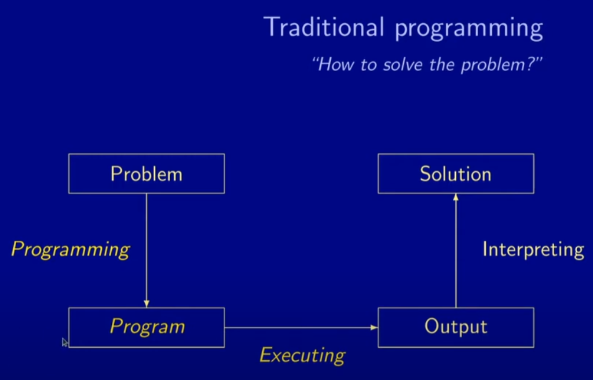
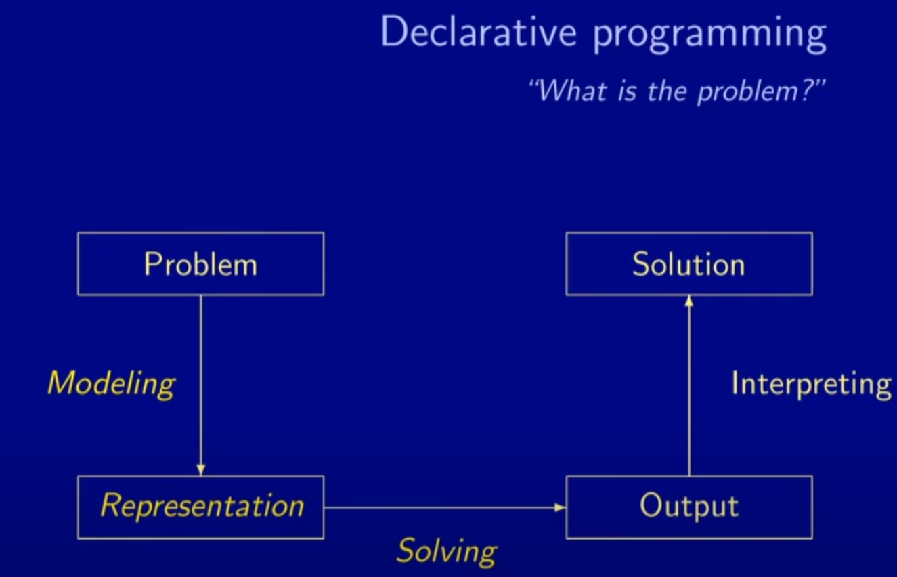
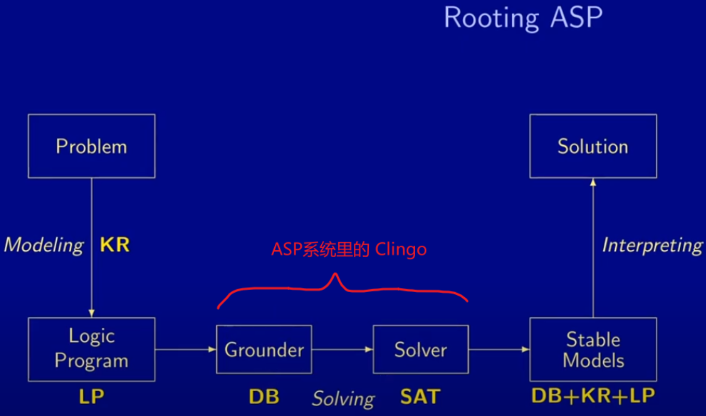

[toc]

# 01 Introduction of ASP

## 引入

### 传统编程与ASP编程

传统编程，侧重于如何去解决这个问题



而ASP侧重于问题是什么，更好的去描述这个问题

> 声明式编程：是计算机专家做出了一套系统，程序员只需要将问题规范化语言然后建模，然后交给电脑或求解器，电脑会自己去解决这个问题



### 基础知识

ASP于逻辑编程很接近，大体上是设置一些 rules，如：

```asp
large(C) :- size(C,S1), size(uk,S2), S1 > S2.
```

1. 一条 rule 的组成：
   - head:      large(C)
   - :-      if
   - body:      size(C,S1), size(uk,S2), S1 > S2.
     - ,      逗号 相当于 and
2. 翻译成英语：
   - A country C is large: if the population size of C is S1, the population size of the UK is S2, and S1 > S2.
3. 注：这不是命令，这是有关large(C)的声明式解释，也算一种 知识表示

**原子 atoms：** rules中的每个元素称为原子

### 工作流



1. KR: knowledge representation
2. LP: logic program
3. DB: database -> 在 grounder(滚地球)这个流程中，实际上，单个rules就是一条sql查询语句，这里就是从数据库里找到对应的 rules
4. SAT: Satisfaction Testing 满意度测试

## 基本概念

### 原子，谓词，常量，变量，比较

```
large(C) :- size(C,S1), size(uk,S2), S1 > S2.

% input
size(france, 65).
size(germany, 83).
size(italy, 61).
size(uk, 64).
```

1. 原子：表示为 谓词(参数)，如: large(), size() 就是原子，large, size 就是谓词

   - 参数：

     - 符号常量：小写字母开头的参数，如：uk, france, germany, italy, uk

     - 数值常量：如 65， 83， 61， 64
     - 变量：以大写字母开头的参数，如：C, S1, S2

2. 比较：S1 > S2

3. 一种省略写法：

```
% 上面size()都是规定input的，多个之间用 ; 分隔：
size(france, 65; germany, 83; italy, 61; uk, 64).
```

### 指令，注释，谓词符号和命令行选项

```
% 1. clingo 中注释为加一个%号来引导
% 定义三条 rules，分别为零个参数，一个，两个
p.
p(a).
p(a, b).

% 2. 指令：控制各种功能，通常前加 #，如 #show指令控制显示哪些内容
% 3. 谓词符号：谓词/元数 后面的元数通常为参数数量
% 下面指令，功能为显示那些参数为0的 rules
#show p/0.

% 4. #const指令和 -c 命令行
% 另一个指令：#const指令，来替换常量
large(C) :- size(C,S1), size(c0,S2), S1 > S2.
% 如：将 c0 常量替换为 uk
#const c0 = uk.
% 另一种方法：使用命令行选项: -c 来替换常量c0
-c c0 = uk.
```

### 算数运算

> 1. 基本运算符: + - * /
>
> 2. 其他
>
>    - ** 指数运算
>
>    - \ 取余
>
>    - |...| 取绝对值
>
> 3. 区间符号：生成连续的数字：2..5      会生成 2 3 4 5

```
% 1 基本运算
p(2**5).		% 32

% 2 区间符号
p(2..5).		% p(2) p(3) p(4) p(5) 或者简写为 p(2; 3; 4; 5)

% 2.1 区间符号的易错点
% 如下两条rules,输出是什么
q(1..2, 1..4).
q(1..4, 1..2).
% 对于第一条rule: q(1,1) q(1,2) q(1,3) q(1,4) q(2,1) q(2,2) q(2,3) q(2,4)
% 对于第二条rule: q(1,1) q(2,1) q(3,1) q(4,1) q(1,2) q(2,2) q(3,2) q(4,2)
% 剔除在这两条 rule 中重复的，剩下：q(1,1) q(1,2) q(1,3) q(1,4) q(2,1) q(2,2) q(2,3) q(2,4) q(3,1) q(4,1) q(3,2) q(4,2)
```


## 进阶概念

### 选择规则

```
% clingo中提供了选择符号 {...}，相当于随机选择true, false
% 如下，一个rule中有两个原子，这两个原子返回的各有两种结果，所以该rule有四种结果
{p(a); q(b)}.
% result1:
% result2: p(a)
% result3: q(b)
% result4: p(a) q(b)

% 选择结果还可以用于省略写法和区间符号
{p(a; b; c)}.	% 等价于{p(a); p(b); p(c)}

{p(1..3)}.		% 等价于{p(1); p(2); p(3)}

```

我们可以指定选择为true的元素的范围，比如至少给我一个true等

```
% 下界{...}上界
% 至少有一个true，至多有2个true
1{p{1..3}}2.
% result1: p(1)
% result2: p(2)
% result3: p(3)
% result4: p(1) p(2)
% result5: p(1) p(3)
% result6: p(2) p(3)

% 也可以只指定一个界
2{p{1..3}}.
```

也可以使用变量，来实现更多的功能

```
{p(X); q(X)} = 1 :- X = 1..n.
```

1. `{p(X); q(X)} = 1` 表示：选择 p(X) 或 q(X) 中的任意一个添加到稳定模型中(true)
2. `X = 1..n` 表示：变量 X 取 1-n 的任意整数
3. 计算可能的稳定模型数量：
   - 先计算X的可能：从1-n选一个，有n种可能
   - 在带入到头部，头部有两种可能
   - 也就是对于每个X，都有两种可能，那么n种可能的X就有 2^n 个可能
   - 例如：n=2，也就是从1，2中选一个X
     - 若X=1：稳定模型为 q(1) or p(1)
     - 若X=2：稳定模型为 q(2) or p(2)

## References

1. Vladimir Lifschitz. *Answer Set Programming*. Springer, 2019.
2. Torsten Schaub. *Answer Set Solving in Practice*. University of Potsdam. October 31, 2020.