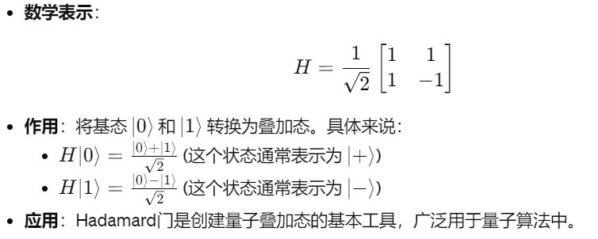
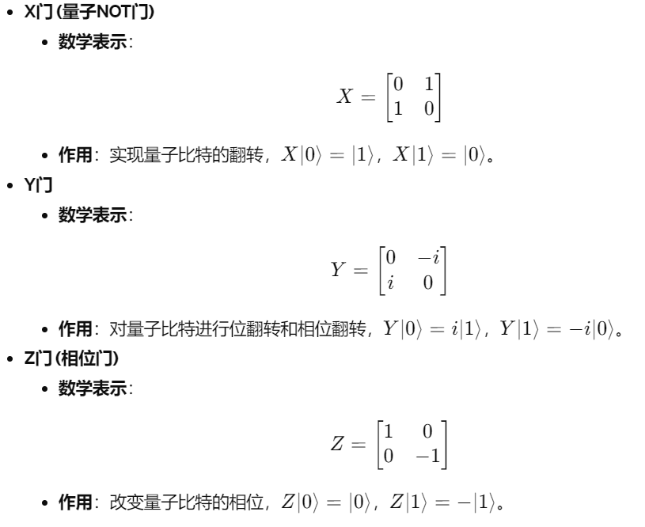
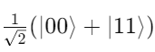
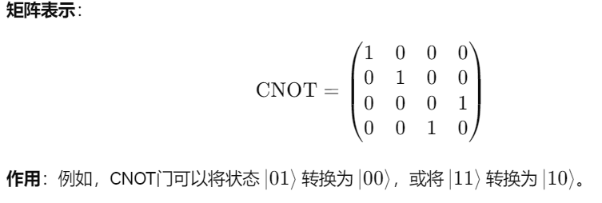
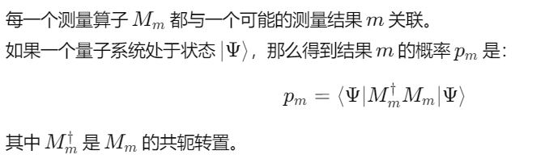
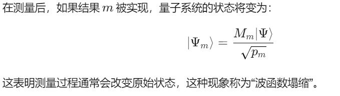
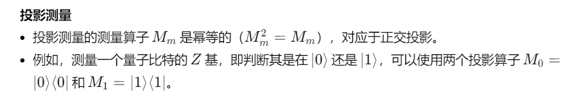

[toc]

# 01

## 量子比特 (Qubits)

1. 是量子计算的基本信息单位。
2. 不同于经典比特只能处于0或1的状态，量子比特可以同时处于0和1的状态，这种状态称为叠加态。

### 性质

量子比特的状态(所有叠加态)都用以下形式来描述： 

∣Φ⟩ = a∣0⟩ + b∣1⟩ 

- ∣Φ⟩ 表示量子比特的状态
- ∣0⟩ 和 ∣1⟩ 是基态
- *a* 和 *b* 是复数，它们描述了量子比特处于各基态的概率振幅

> 为了保证整个系统的概率密度总和为1（即系统必须处于某种状态, *a* 和 *b* 必须满足： ∣a∣^2 + ∣b∣^2 = 1
>
> 这里的 ∣a∣^2 表示测量结果得到 ∣0⟩ 的概率，∣b∣^2 表示测量结果得到 ∣1⟩ 的概率

## 单量子比特门(Single Qubit Gates)

是量子计算中用来操纵单个量子比特的基本操作单元，类似于传统逻辑电路中的逻辑门。这些门可以改变量子比特的状态，包括它的相位和概率振幅。

### 基本的门

#### Hadamard门 (H门)

#### Pauli门

## 多量子比特系统

在量子计算中，当我们组合两个或多个量子比特时，系统的状态不再是单个量子比特的状态的简单组合，而是所有可能组合的复合状态。

### 张量积(Tensor Product)

在一个系统中，多个量子比特状态的组合方式

例如，如果有两个量子比特，第一个在状态 ∣0⟩，第二个在状态 ∣1⟩，则组合状态(张量积)表示为 ∣0⟩⊗∣1⟩，简写为 ∣01⟩

### 量子纠缠

表示两个或多个量子比特之间的非经典关联。当量子比特处于纠缠态时，对一个量子比特的测量会立即影响到其他量子比特的状态，无论它们之间相隔多远。

#### 常见纠缠态

贝尔态 (Bell State)

贝尔态是一种常见的纠缠态，例如：

这种态表明，如果在某个基础上测量第一个量子比特并得到 ∣0⟩，则第二个量子比特也立即被确定为 ∣0⟩，反之亦然。

### 多量子比特门

用于在多个量子比特之间创建和操纵纠缠的量子门。

#### CNOT门

是一个两量子比特门，如果第一个量子比特（控制比特）为 ∣1⟩，它就会翻转第二个量子比特（目标比特）的状态。

## 量子测量(Quantum Measurements)

量子测量可以影响量子系统的状态，通常会导致量子状态的塌缩。

在量子力学中，测量可以理解为一组特定的操作符，称为测量算子。这些算子会产生不同结果。

### 测量算子

### 测量后的状态

### 测量的类型

如：投影测量（Projective Measurements）

